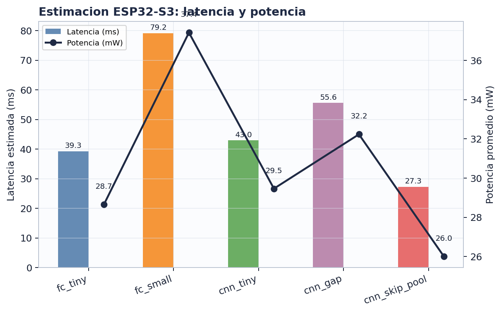

# Ejercicio 2.3 - Estimacion en ESP32-S3

La latencia, FPS, potencia y movimiento de memoria se estiman para un ESP32-S3 usando las MACs reales de cada red exportada. Se usa inferencia float32 sin cuantizacion como caso base conservador.

## Supuestos
| Parametro | Valor |
| --- | --- |
| Throughput efectivo | 30 MMAC/s |
| Potencia idle | 20 mW |
| Potencia activa CPU | 240 mW |
| Frame objetivo | 1 segundo |
| Pesos/activaciones | float32 = 4 bytes |
| Limite SRAM interna | 512 KB |

## Formulas usadas
```text
latencia_s = MACs / 30,000,000
latencia_ms = latencia_s * 1000
FPS_estimado = 1 / latencia_s
potencia_mW = 20 + min(latencia_s / 1s, 1) * (240 - 20)
pesos_KB = parametros * 4 / 1024
bytes_movidos_capa = 4 * (elementos_input + elementos_output + parametros_capa)
activacion_pico_KB = max(tensores_intermedios) * 4 / 1024
```

## Ejemplo aplicado: cnn_skip_pool
```text
MACs = 818,496
latencia = 818,496 / 30,000,000 = 0.02728 s = 27.28 ms
FPS = 1 / 0.02728 = 36.7 FPS
potencia = 20 + 0.02728 * 220 = 26.0 mW
pesos = 14,060 * 4 / 1024 = 54.9 KB
```

## Resultados
| Modelo | Latencia | FPS | Potencia | Pesos | Act. pico | Trafico capas | SRAM |
| --- | --- | --- | --- | --- | --- | --- | --- |
| fc_tiny | 39.34 ms | 25.4 | 28.7 mW | 4610.5 KB | 36.0 KB | 4648.5 KB | NO |
| fc_small | 79.20 ms | 12.6 | 37.4 mW | 9282.3 KB | 36.0 KB | 9323.3 KB | NO |
| cnn_tiny | 43.02 ms | 23.2 | 29.5 mW | 1154.6 KB | 144.0 KB | 2163.6 KB | NO |
| cnn_gap | 55.61 ms | 18.0 | 32.2 mW | 6.1 KB | 144.0 KB | 1158.3 KB | OK |
| cnn_skip_pool | 27.28 ms | 36.7 | 26.0 mW | 54.9 KB | 36.0 KB | 555.6 KB | OK |



## Conclusion
fc_tiny, fc_small y cnn_tiny quedan fuera del presupuesto de SRAM interna en float32. cnn_gap y cnn_skip_pool caben; cnn_skip_pool combina menor latencia, menor potencia estimada y accuracy competitivo.