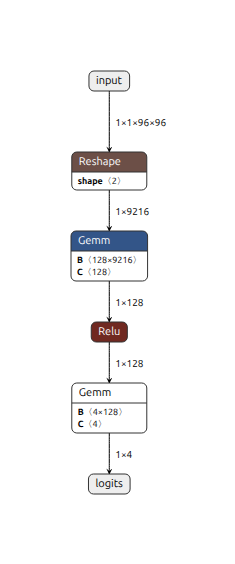
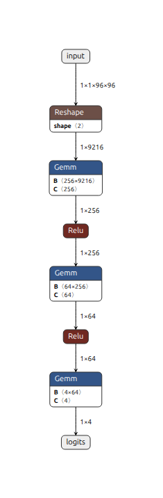
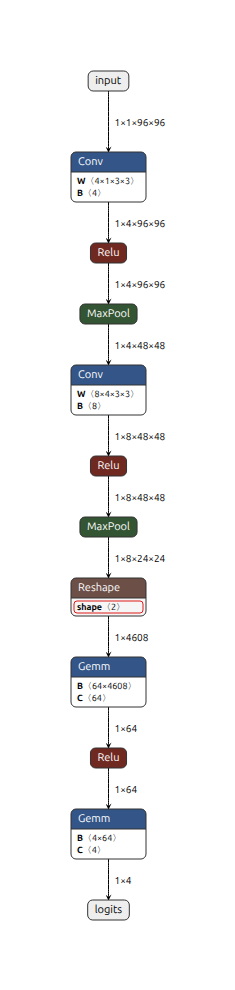
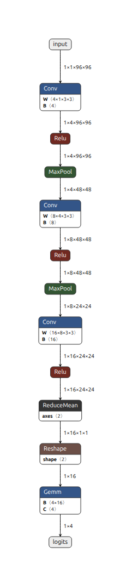
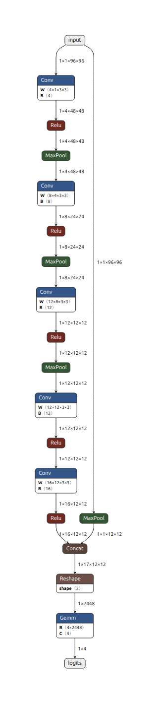
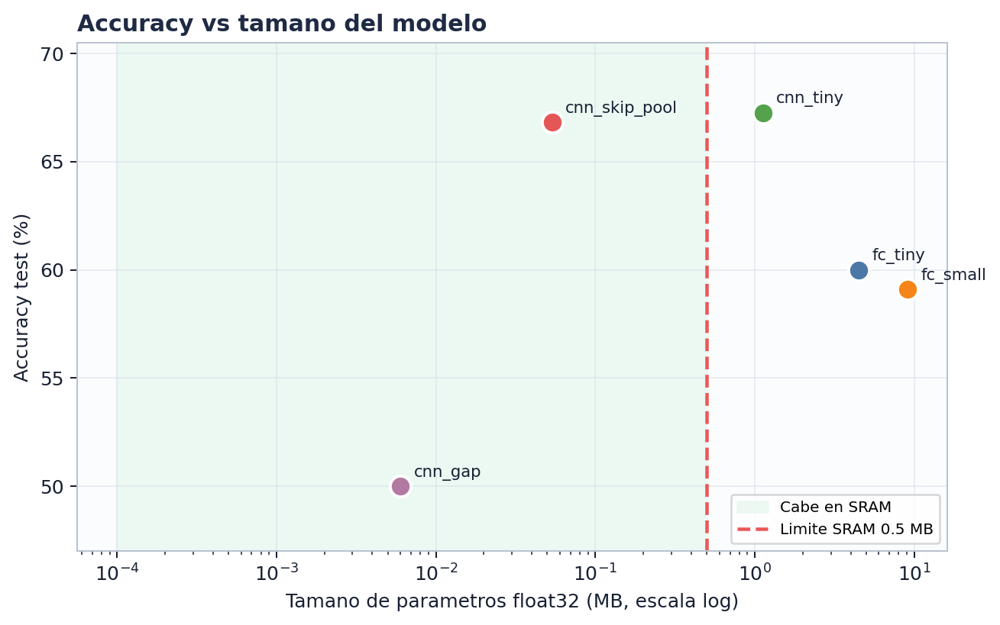
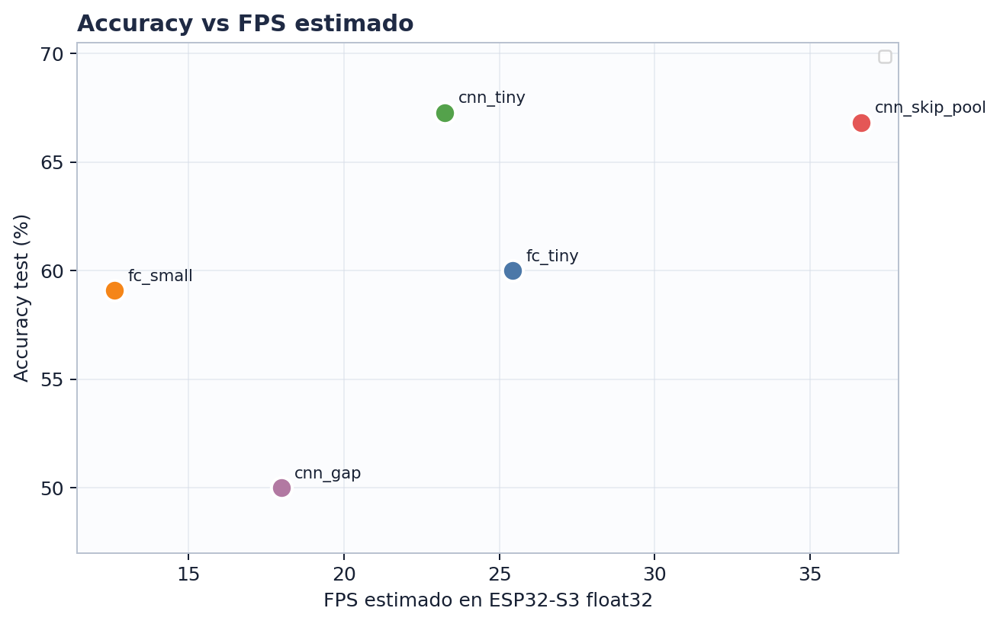
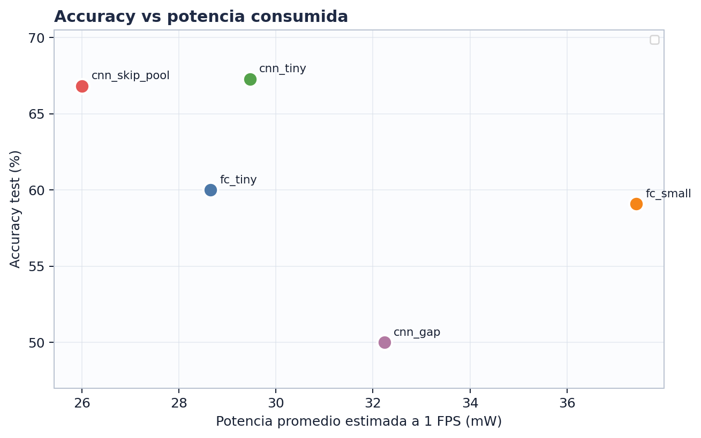
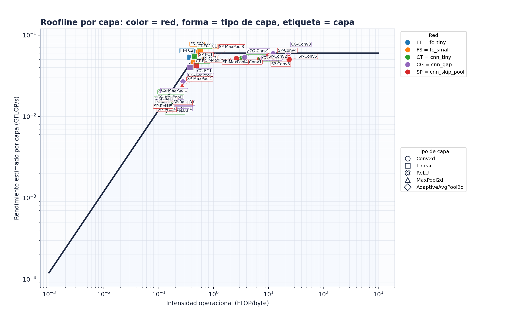

# Ejercicio 2.2 - Modelos

Cinco topologias pequenas entrenadas desde `model.py`: dos fully connected y tres CNN. Las imagenes se redimensionan en memoria a 96x96, que es el tamano esperado por las arquitecturas.

## Resumen de metricas
| Modelo | Val acc | Test acc | Params | Tamano | MACs | FLOPs | ONNX |
| --- | --- | --- | --- | --- | --- | --- | --- |
| fc_tiny | 61.50% | 60.00% | 1,180,292 | 4.5025 MB | 1.18e+06 | 2.36e+06 | fc_tiny.onnx |
| fc_small | 60.59% | 59.09% | 2,376,260 | 9.0647 MB | 2.38e+06 | 4.75e+06 | fc_small.onnx |
| cnn_tiny | 69.70% | 67.27% | 295,572 | 1.1275 MB | 1.29e+06 | 2.58e+06 | cnn_tiny.onnx |
| cnn_gap | 51.94% | 50.00% | 1,572 | 0.0060 MB | 1.67e+06 | 3.34e+06 | cnn_gap.onnx |
| cnn_skip_pool | 73.35% | 66.82% | 14,060 | 0.0536 MB | 8.18e+05 | 1.64e+06 | cnn_skip_pool.onnx |

## Calculo de metricas reportadas
```text
accuracy = aciertos / total_muestras
tamano_parametros_MB = parametros * 4 bytes / 1024^2  (float32)
FLOPs ~= 2 * MACs
MACs se obtuvieron con thop.profile(model, input=(1,1,96,96))
ONNX se exporto con torch.onnx.export y se abrio en Netron para las capturas.
```

## Lectura rapida
cnn_tiny alcanza el mayor accuracy de test, pero ocupa mas de 1 MB en parametros float32. cnn_skip_pool queda practicamente empatado en accuracy, usa solo 0.0536 MB y necesita menos operaciones, por lo que se conserva como candidato principal para ESP32-S3.

## Visualizaciones Netron
### fc_tiny
Test acc: 60.00% | Tamano: 4.5025 MB | MACs: 1.18e+06


### fc_small
Test acc: 59.09% | Tamano: 9.0647 MB | MACs: 2.38e+06


### cnn_tiny
Test acc: 67.27% | Tamano: 1.1275 MB | MACs: 1.29e+06


### cnn_gap
Test acc: 50.00% | Tamano: 0.0060 MB | MACs: 1.67e+06


### cnn_skip_pool
Test acc: 66.82% | Tamano: 0.0536 MB | MACs: 8.18e+05



---

# Ejercicio 2.3 - Estimacion en ESP32-S3

La latencia, FPS, potencia y movimiento de memoria se estiman para un ESP32-S3 usando las MACs reales de cada red exportada. Se usa inferencia float32 sin cuantizacion como caso base conservador.

## Supuestos
| Parametro | Valor |
| --- | --- |
| Throughput efectivo | 30 MMAC/s |
| Potencia idle | 20 mW |
| Potencia activa CPU | 240 mW |
| Frame objetivo | 1 segundo |
| Pesos/activaciones | float32 = 4 bytes |
| Limite SRAM interna | 512 KB |

## Formulas usadas
```text
latencia_s = MACs / 30,000,000
latencia_ms = latencia_s * 1000
FPS_estimado = 1 / latencia_s
potencia_mW = 20 + min(latencia_s / 1s, 1) * (240 - 20)
pesos_KB = parametros * 4 / 1024
bytes_movidos_capa = 4 * (elementos_input + elementos_output + parametros_capa)
activacion_pico_KB = max(tensores_intermedios) * 4 / 1024
```

## Ejemplo aplicado: cnn_skip_pool
```text
MACs = 818,496
latencia = 818,496 / 30,000,000 = 0.02728 s = 27.28 ms
FPS = 1 / 0.02728 = 36.7 FPS
potencia = 20 + 0.02728 * 220 = 26.0 mW
pesos = 14,060 * 4 / 1024 = 54.9 KB
```

## Resultados
| Modelo | Latencia | FPS | Potencia | Pesos | Act. pico | Trafico capas | SRAM |
| --- | --- | --- | --- | --- | --- | --- | --- |
| fc_tiny | 39.34 ms | 25.4 | 28.7 mW | 4610.5 KB | 36.0 KB | 4648.5 KB | NO |
| fc_small | 79.20 ms | 12.6 | 37.4 mW | 9282.3 KB | 36.0 KB | 9323.3 KB | NO |
| cnn_tiny | 43.02 ms | 23.2 | 29.5 mW | 1154.6 KB | 144.0 KB | 2163.6 KB | NO |
| cnn_gap | 55.61 ms | 18.0 | 32.2 mW | 6.1 KB | 144.0 KB | 1158.3 KB | OK |
| cnn_skip_pool | 27.28 ms | 36.7 | 26.0 mW | 54.9 KB | 36.0 KB | 555.6 KB | OK |


## Conclusion
fc_tiny, fc_small y cnn_tiny quedan fuera del presupuesto de SRAM interna en float32. cnn_gap y cnn_skip_pool caben; cnn_skip_pool combina menor latencia, menor potencia estimada y accuracy competitivo.

---

# Ejercicio 2.4 - Analisis

Red elegida: `cnn_skip_pool` | Test acc: 66.82% | Latencia: 27.3 ms | Tamano: 54.9 KB

## Como se construyeron los graficos
```text
Cada punto = una topologia entrenada.
Eje Y = accuracy de test.
Accuracy vs tamano: eje X = parametros * 4 / 1024^2; linea roja = 0.5 MB SRAM.
Accuracy vs FPS: eje X = 1 / (MACs / 30e6).
Accuracy vs potencia: eje X = potencia_mW estimada con carga a 1 FPS.
```

## Accuracy vs tamano


## Accuracy vs FPS


## Accuracy vs potencia


## Roofline por capa


## Calculo del Roofline
```text
FLOPs_conv = elementos_output * (canales_in/groups * kernel_h * kernel_w) * 2
FLOPs_linear = elementos_output * in_features * 2
intensidad_operacional = FLOPs / bytes_movidos
tiempo_capa = max(FLOPs / pico_compute, bytes_movidos / bandwidth_memoria)
rendimiento_capa = FLOPs / tiempo_capa
pico_compute = 30 MMAC/s * 2 = 0.060 GFLOP/s
bandwidth = 0.12 GB/s
```

## Mapa de etiquetas del Roofline
| Etiqueta | Modelo | Capa / tipo | Salida |
| --- | --- | --- | --- |
| FT-FC1 | fc_tiny | net.1 (FC) | 1x128 |
| FT-ReLU1 | fc_tiny | net.2 (ReLU) | 1x128 |
| FT-FC2 | fc_tiny | net.3 (FC) | 1x4 |
| FS-FC1 | fc_small | net.1 (FC) | 1x256 |
| FS-ReLU1 | fc_small | net.2 (ReLU) | 1x256 |
| FS-FC2 | fc_small | net.4 (FC) | 1x64 |
| FS-ReLU2 | fc_small | net.5 (ReLU) | 1x64 |
| FS-FC3 | fc_small | net.6 (FC) | 1x4 |
| CT-Conv1 | cnn_tiny | features.0 (Conv) | 1x4x96x96 |
| CT-ReLU1 | cnn_tiny | features.1 (ReLU) | 1x4x96x96 |
| CT-MaxPool1 | cnn_tiny | features.2 (MaxPool) | 1x4x48x48 |
| CT-Conv2 | cnn_tiny | features.3 (Conv) | 1x8x48x48 |
| CT-ReLU2 | cnn_tiny | features.4 (ReLU) | 1x8x48x48 |
| CT-MaxPool2 | cnn_tiny | features.5 (MaxPool) | 1x8x24x24 |
| CT-FC1 | cnn_tiny | classifier.1 (FC) | 1x64 |
| CT-ReLU3 | cnn_tiny | classifier.2 (ReLU) | 1x64 |
| CT-FC2 | cnn_tiny | classifier.3 (FC) | 1x4 |
| CG-Conv1 | cnn_gap | features.0 (Conv) | 1x4x96x96 |
| CG-ReLU1 | cnn_gap | features.1 (ReLU) | 1x4x96x96 |
| CG-MaxPool1 | cnn_gap | features.2 (MaxPool) | 1x4x48x48 |
| CG-Conv2 | cnn_gap | features.3 (Conv) | 1x8x48x48 |
| CG-ReLU2 | cnn_gap | features.4 (ReLU) | 1x8x48x48 |
| CG-MaxPool2 | cnn_gap | features.5 (MaxPool) | 1x8x24x24 |
| CG-Conv3 | cnn_gap | features.6 (Conv) | 1x16x24x24 |
| CG-ReLU3 | cnn_gap | features.7 (ReLU) | 1x16x24x24 |
| CG-AvgPool1 | cnn_gap | features.8 (AvgPool) | 1x16x1x1 |
| CG-FC1 | cnn_gap | classifier (FC) | 1x4 |
| SP-MaxPool1 | cnn_skip_pool | skip_pool (MaxPool) | 1x1x12x12 |
| SP-Conv1 | cnn_skip_pool | conv.0 (Conv) | 1x4x48x48 |
| SP-ReLU1 | cnn_skip_pool | conv.1 (ReLU) | 1x4x48x48 |
| SP-MaxPool2 | cnn_skip_pool | conv.2 (MaxPool) | 1x4x48x48 |
| SP-Conv2 | cnn_skip_pool | conv.3 (Conv) | 1x8x24x24 |
| SP-ReLU2 | cnn_skip_pool | conv.4 (ReLU) | 1x8x24x24 |
| SP-MaxPool3 | cnn_skip_pool | conv.5 (MaxPool) | 1x8x24x24 |
| SP-Conv3 | cnn_skip_pool | conv.6 (Conv) | 1x12x12x12 |
| SP-ReLU3 | cnn_skip_pool | conv.7 (ReLU) | 1x12x12x12 |
| SP-MaxPool4 | cnn_skip_pool | conv.8 (MaxPool) | 1x12x12x12 |
| SP-Conv4 | cnn_skip_pool | conv.9 (Conv) | 1x12x12x12 |
| SP-ReLU4 | cnn_skip_pool | conv.10 (ReLU) | 1x12x12x12 |
| SP-Conv5 | cnn_skip_pool | conv.11 (Conv) | 1x16x12x12 |
| SP-ReLU5 | cnn_skip_pool | conv.12 (ReLU) | 1x16x12x12 |
| SP-FC1 | cnn_skip_pool | classifier.1 (FC) | 1x4 |

## Analisis y decision
| Modelo | Veredicto | Analisis |
| --- | --- | --- |
| fc_tiny / fc_small | No recomendadas | Accuracy alrededor de 60%, pero pesos de 4.50 MB y 9.06 MB en float32; exceden la SRAM interna. |
| cnn_tiny | Buen accuracy, mala memoria | Mejor test acc (67.27%), pero 1.13 MB de parametros. Requiere PSRAM o int8 para ser realista. |
| cnn_gap | Muy pequena, baja precision | Solo 6.1 KB de pesos, pero test acc de 50.00%. |
| cnn_skip_pool | Elegida | 66.82% test acc, 73.35% val acc, 54.9 KB de pesos, 0.82 MMACs, 27.3 ms y 36.7 FPS estimados. |

Decision final: usar `cnn_skip_pool`. Mantiene accuracy competitivo frente a cnn_tiny, pero con una fraccion del tamano y menor costo computacional. Para la implementacion final en ESP32-S3 se recomienda cuantizacion int8 con ESP-NN/TFLite Micro.