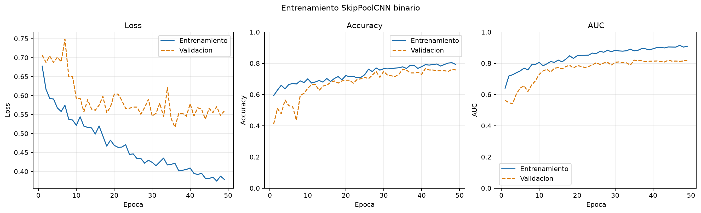
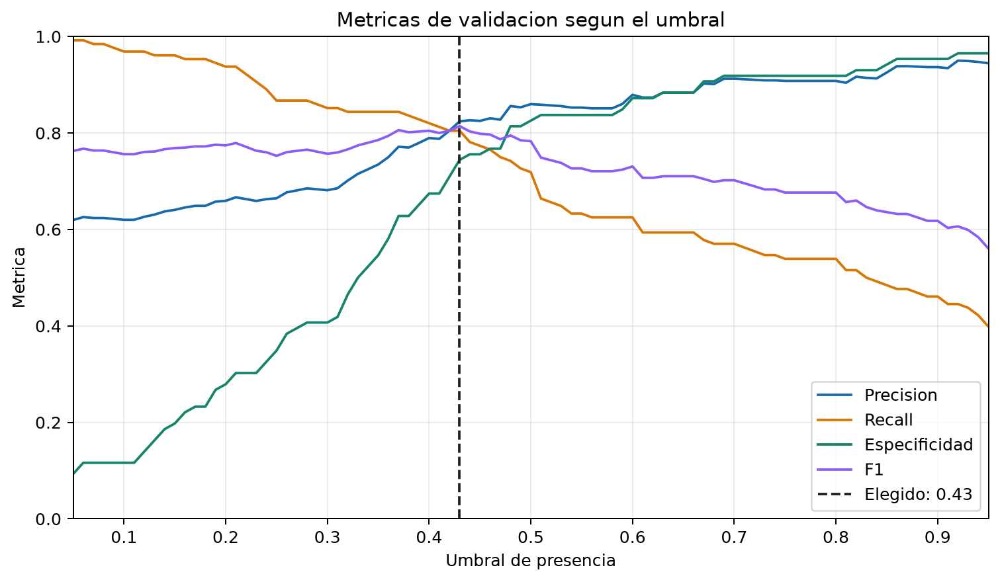
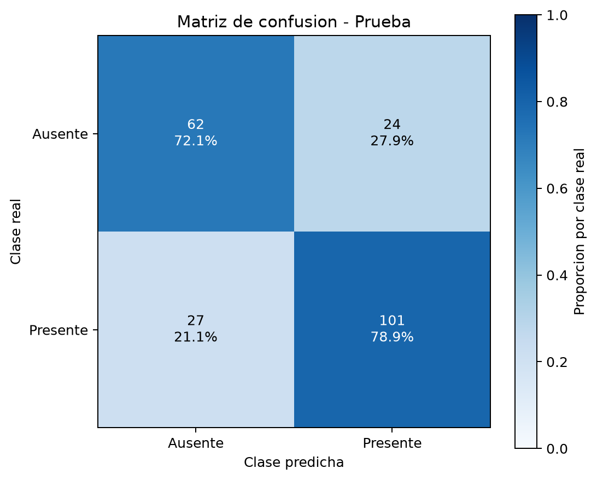

# Binary SkipPoolCNN Presence Report

Generated: 2026-06-21T20:58:05

## Dataset

- Source filter: `esp`
- Label files used: 4
- Samples used: 1420
- Absent class 0: 570
- Present class 1: 850
- Missing image references skipped: 0
- Bad label lines skipped: 0

## Splits

| split | total | absent_0 | present_1 |
| --- | ---: | ---: | ---: |
| train | 992 | 398 | 594 |
| val | 214 | 86 | 128 |
| test | 214 | 86 | 128 |

## Model

- Architecture: `SkipPoolCNN binary (multiscale)`
- Input: `96x96x1` grayscale, raw pixel range 0..255.
- Total parameters: 96679
- Estimated FP32 parameter memory: `0.3688 MB`.
- Positive class weight multiplier: `1.0`
- Core ops: Conv2D, BatchNorm, Max/AveragePool2D, Flatten, Dense, Sigmoid.

## Metrics

Threshold: `0.4300` (best validation f1)

| split | accuracy | precision | recall | specificity | balanced_accuracy | f1 | f2 | mcc | tn | fp | fn | tp |
| --- | ---: | ---: | ---: | ---: | ---: | ---: | ---: | ---: | ---: | ---: | ---: | ---: |
| val | 0.7804 | 0.8240 | 0.8047 | 0.7442 | 0.7744 | 0.8142 | 0.8085 | 0.5460 | 64 | 22 | 25 | 103 |
| test | 0.7617 | 0.8080 | 0.7891 | 0.7209 | 0.7550 | 0.7984 | 0.7928 | 0.5073 | 62 | 24 | 27 | 101 |
| test_int8 | 0.7570 | 0.8016 | 0.7891 | 0.7093 | 0.7492 | 0.7953 | 0.7915 | 0.4966 | 61 | 25 | 27 | 101 |

## Model Sizes

Sizes use `1 MB = 1024^2 bytes`.

| artifact | size_mb |
| --- | ---: |
| keras | 1.1834 |
| tflite_float32 | 0.3729 |
| tflite_int8 | 0.0993 |

## Artifacts

- keras: `outputs\skippool_presence_binary_improved\best_skippool_presence_binary.keras`
- history: `outputs\skippool_presence_binary_improved\history.csv`
- dataset_summary: `outputs\skippool_presence_binary_improved\dataset_summary.csv`
- plot_training_curves: `outputs\skippool_presence_binary_improved\plots\training_curves.png`
- plot_threshold_analysis: `outputs\skippool_presence_binary_improved\plots\threshold_analysis.png`
- plot_confusion_matrix_test: `outputs\skippool_presence_binary_improved\plots\confusion_matrix_test.png`
- tflite_float32: `outputs\skippool_presence_binary_improved\skippool_presence_binary_float32.tflite`
- tflite_int8: `outputs\skippool_presence_binary_improved\skippool_presence_binary_int8.tflite`
- tflite_micro_cc: `outputs\skippool_presence_binary_improved\skippool_presence_binary_model_data.cc`
- tflite_micro_h: `outputs\skippool_presence_binary_improved\skippool_presence_binary_model_data.h`

## Evaluation Plots

### Training Curves



### Validation Threshold



### Test Confusion Matrix



## TFLite Quantization Info

```json
{
  "float32": {
    "input_name": "grayscale_96x96",
    "input_shape": [
      1,
      96,
      96,
      1
    ],
    "input_dtype": "<class 'numpy.float32'>",
    "input_quantization": [
      0.0,
      0.0
    ],
    "output_name": "Identity",
    "output_shape": [
      1,
      1
    ],
    "output_dtype": "<class 'numpy.float32'>",
    "output_quantization": [
      0.0,
      0.0
    ]
  },
  "int8": {
    "input_name": "grayscale_96x96",
    "input_shape": [
      1,
      96,
      96,
      1
    ],
    "input_dtype": "<class 'numpy.int8'>",
    "input_quantization": [
      1.0,
      -128.0
    ],
    "output_name": "Identity",
    "output_shape": [
      1,
      1
    ],
    "output_dtype": "<class 'numpy.int8'>",
    "output_quantization": [
      0.00390625,
      -128.0
    ]
  }
}
```

## ESP Notes

- Capture 96x96 grayscale frames on the ESP camera.
- Feed pixels in row-major order. For the int8 model, quantize each pixel with:
  `input_int8 = round(pixel / input_scale + input_zero_point)`.
- The output is a sigmoid probability after dequantization. Presence is true when it is >= threshold.

## Keras Summary

```text
Layer (type) | Output shape | Params
--- | --- | ---
grayscale_96x96 (InputLayer) | (None, 96, 96, 1) | 0
scale_to_0_1 (Rescaling) | (None, 96, 96, 1) | 0
conv_0 (Conv2D) | (None, 48, 48, 6) | 54
batch_norm_0 (BatchNormalization) | (None, 48, 48, 6) | 24
relu_0 (ReLU) | (None, 48, 48, 6) | 0
conv_1 (Conv2D) | (None, 24, 24, 12) | 648
batch_norm_1 (BatchNormalization) | (None, 24, 24, 12) | 48
relu_1 (ReLU) | (None, 24, 24, 12) | 0
conv_2 (Conv2D) | (None, 12, 12, 18) | 1944
batch_norm_2 (BatchNormalization) | (None, 12, 12, 18) | 72
relu_2 (ReLU) | (None, 12, 12, 18) | 0
conv_3 (Conv2D) | (None, 12, 12, 24) | 3888
batch_norm_3 (BatchNormalization) | (None, 12, 12, 24) | 96
relu_3 (ReLU) | (None, 12, 12, 24) | 0
skip_max_pool (MaxPooling2D) | (None, 12, 12, 1) | 0
skip_average_pool (AveragePooling2D) | (None, 12, 12, 1) | 0
concat_skip (Concatenate) | (None, 12, 12, 26) | 0
flatten_spatial_features (Flatten) | (None, 3744) | 0
spatial_head (Dense) | (None, 24) | 89880
head_dropout (Dropout) | (None, 24) | 0
presence (Dense) | (None, 1) | 25

Total params: 96679
Trainable params: 96559
Non-trainable params: 120
```
