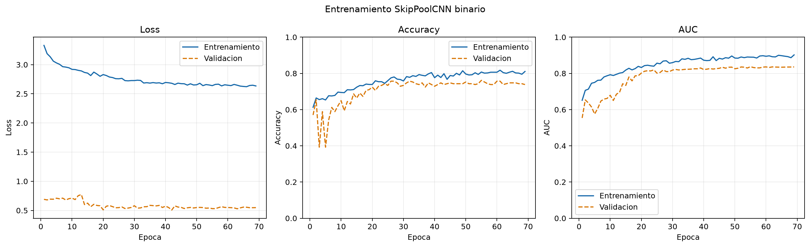
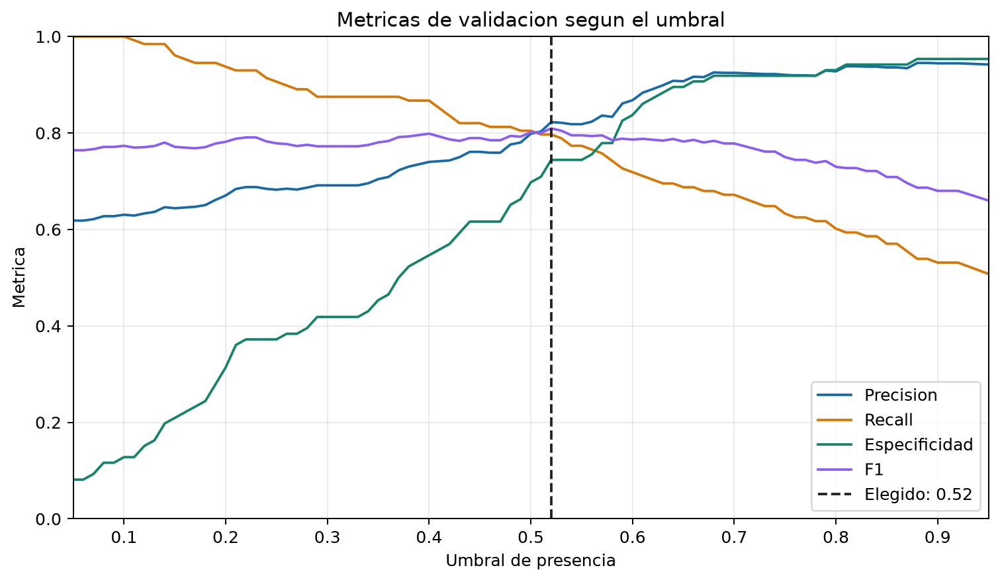
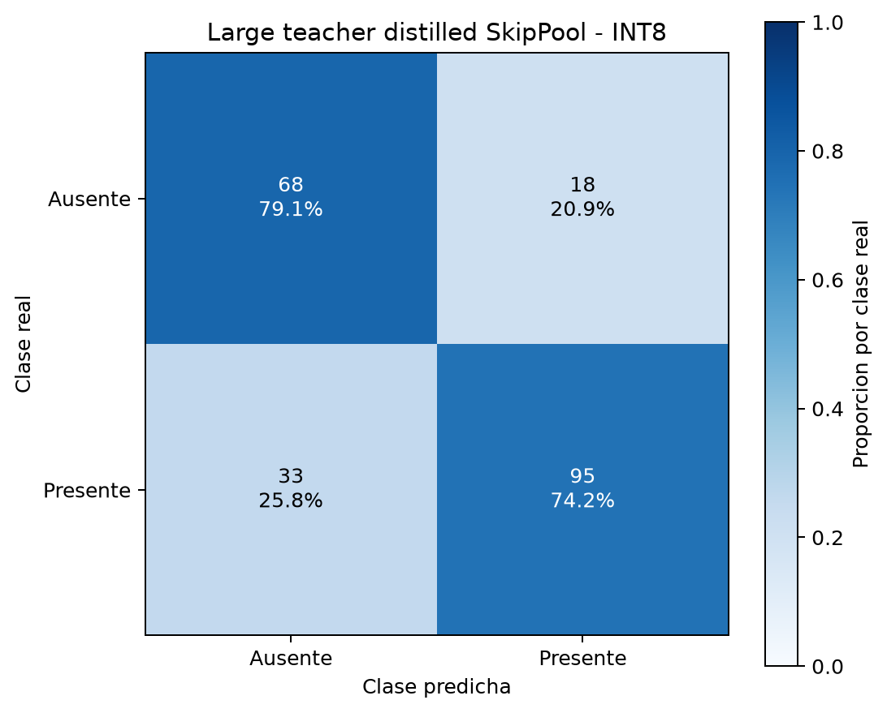

# Large Teacher -> SkipPool Knowledge Distillation Report

Generated: 2026-06-21T22:19:20

## Configuration

- Teacher: `MobileNetV2 (imagenet)`
- Teacher parameters: `2749889`
- Student: `SkipPoolCNN binary (multiscale)`
- Student parameters: `96679`
- Compression by parameter count: `96.48%`
- Alpha: `0.5`
- Temperature: `3.0`
- Teacher head/fine-tune epochs: `20` / `15`

## Thresholds

- teacher: `0.4700`
- baseline: `0.4700`
- student: `0.5200`

## Metrics

| model | accuracy | precision | recall | specificity | balanced_accuracy | f1 | f2 | mcc | tn | fp | fn | tp |
| --- | ---: | ---: | ---: | ---: | ---: | ---: | ---: | ---: | ---: | ---: | ---: | ---: |
| teacher_test | 0.9112 | 0.9291 | 0.9219 | 0.8953 | 0.9086 | 0.9255 | 0.9233 | 0.8157 | 77 | 9 | 10 | 118 |
| baseline_test | 0.7336 | 0.8257 | 0.7031 | 0.7791 | 0.7411 | 0.7595 | 0.7246 | 0.4729 | 67 | 19 | 38 | 90 |
| student_val | 0.7757 | 0.8226 | 0.7969 | 0.7442 | 0.7705 | 0.8095 | 0.8019 | 0.5374 | 64 | 22 | 26 | 102 |
| student_test | 0.7477 | 0.8364 | 0.7188 | 0.7907 | 0.7547 | 0.7731 | 0.7395 | 0.4997 | 68 | 18 | 36 | 92 |
| student_test_int8 | 0.7617 | 0.8407 | 0.7422 | 0.7907 | 0.7664 | 0.7884 | 0.7600 | 0.5233 | 68 | 18 | 33 | 95 |

## Model Sizes

| artifact | size_mb |
| --- | ---: |
| teacher_keras | 27.4868 |
| baseline_keras | 1.1834 |
| student_keras | 0.4360 |
| student_tflite_float32 | 0.3729 |
| student_tflite_int8 | 0.0993 |

## Artifacts

- teacher_keras: `outputs\skippool_presence_large_teacher_distilled_alpha05\large_mobilenetv2_teacher.keras`
- baseline_keras: `outputs\skippool_presence_large_teacher_distilled_alpha05\skippool_baseline.keras`
- student_keras: `outputs\skippool_presence_large_teacher_distilled_alpha05\distilled_skippool_student.keras`
- teacher_head_history: `outputs\skippool_presence_large_teacher_distilled_alpha05\teacher_head_history.csv`
- baseline_history: `outputs\skippool_presence_large_teacher_distilled_alpha05\baseline_history.csv`
- distillation_history: `outputs\skippool_presence_large_teacher_distilled_alpha05\distillation_history.csv`
- teacher_finetune_history: `outputs\skippool_presence_large_teacher_distilled_alpha05\teacher_finetune_history.csv`
- tflite_float32: `outputs\skippool_presence_large_teacher_distilled_alpha05\skippool_presence_large_teacher_distilled_float32.tflite`
- tflite_int8: `outputs\skippool_presence_large_teacher_distilled_alpha05\skippool_presence_large_teacher_distilled_int8.tflite`
- tflite_micro_cc: `outputs\skippool_presence_large_teacher_distilled_alpha05\skippool_presence_large_teacher_distilled_model_data.cc`
- tflite_micro_h: `outputs\skippool_presence_large_teacher_distilled_alpha05\skippool_presence_large_teacher_distilled_model_data.h`

## Plots








## TFLite

```json
{
  "float32": {
    "input_name": "grayscale_96x96",
    "input_shape": [
      1,
      96,
      96,
      1
    ],
    "input_dtype": "<class 'numpy.float32'>",
    "input_quantization": [
      0.0,
      0.0
    ],
    "output_name": "Identity",
    "output_shape": [
      1,
      1
    ],
    "output_dtype": "<class 'numpy.float32'>",
    "output_quantization": [
      0.0,
      0.0
    ]
  },
  "int8": {
    "input_name": "grayscale_96x96",
    "input_shape": [
      1,
      96,
      96,
      1
    ],
    "input_dtype": "<class 'numpy.int8'>",
    "input_quantization": [
      1.0,
      -128.0
    ],
    "output_name": "Identity",
    "output_shape": [
      1,
      1
    ],
    "output_dtype": "<class 'numpy.int8'>",
    "output_quantization": [
      0.00390625,
      -128.0
    ]
  }
}
```
