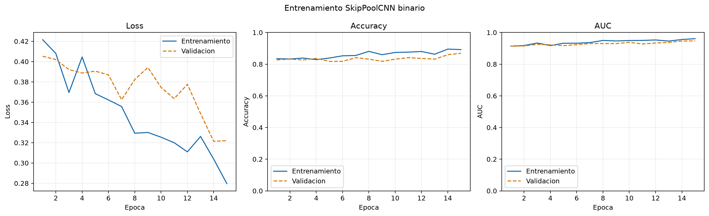
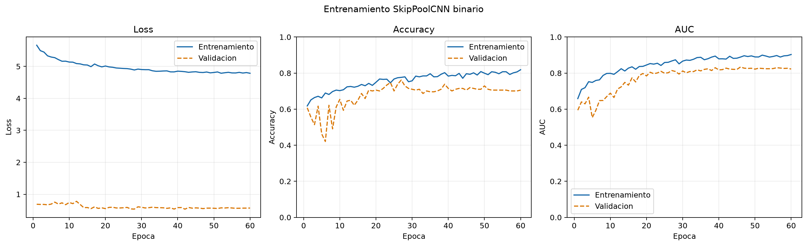
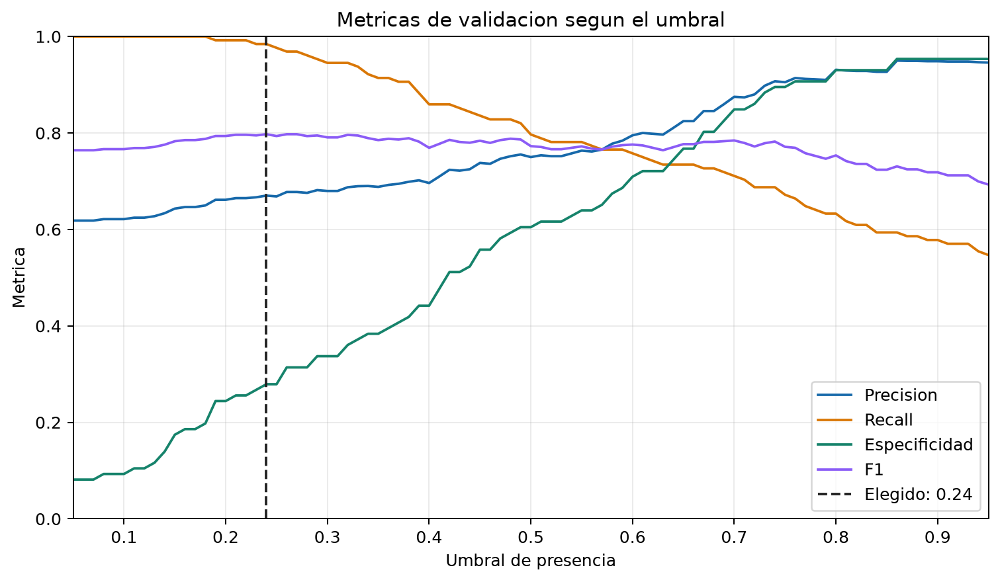
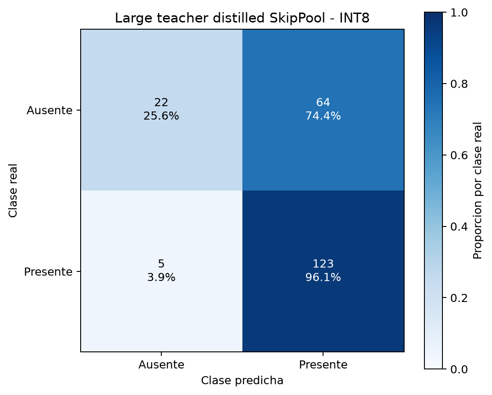

# Large Teacher -> SkipPool Knowledge Distillation Report

Generated: 2026-06-21T22:36:07

## Configuration

- Teacher: `MobileNetV2 (imagenet)`
- Teacher parameters: `2749889`
- Student: `SkipPoolCNN binary (multiscale)`
- Student parameters: `96679`
- Compression by parameter count: `96.48%`
- Alpha: `0.5`
- Temperature: `4.0`
- Teacher head/fine-tune epochs: `20` / `15`

## Thresholds

- teacher: `0.4700`
- baseline: `0.4700`
- student: `0.2400`

## Metrics

| model | accuracy | precision | recall | specificity | balanced_accuracy | f1 | f2 | mcc | tn | fp | fn | tp |
| --- | ---: | ---: | ---: | ---: | ---: | ---: | ---: | ---: | ---: | ---: | ---: | ---: |
| teacher_test | 0.9112 | 0.9291 | 0.9219 | 0.8953 | 0.9086 | 0.9255 | 0.9233 | 0.8157 | 77 | 9 | 10 | 118 |
| baseline_test | 0.7336 | 0.8257 | 0.7031 | 0.7791 | 0.7411 | 0.7595 | 0.7246 | 0.4729 | 67 | 19 | 38 | 90 |
| student_val | 0.7009 | 0.6702 | 0.9844 | 0.2791 | 0.6317 | 0.7975 | 0.9000 | 0.3953 | 24 | 62 | 2 | 126 |
| student_test | 0.6776 | 0.6578 | 0.9609 | 0.2558 | 0.6084 | 0.7810 | 0.8798 | 0.3200 | 22 | 64 | 5 | 123 |
| student_test_int8 | 0.6776 | 0.6578 | 0.9609 | 0.2558 | 0.6084 | 0.7810 | 0.8798 | 0.3200 | 22 | 64 | 5 | 123 |

## Model Sizes

| artifact | size_mb |
| --- | ---: |
| teacher_keras | 27.4868 |
| baseline_keras | 1.1834 |
| student_keras | 0.4360 |
| student_tflite_float32 | 0.3729 |
| student_tflite_int8 | 0.0993 |

## Artifacts

- teacher_keras: `outputs\skippool_presence_large_teacher_distilled_alpha05_temp4\large_mobilenetv2_teacher.keras`
- baseline_keras: `outputs\skippool_presence_large_teacher_distilled_alpha05_temp4\skippool_baseline.keras`
- student_keras: `outputs\skippool_presence_large_teacher_distilled_alpha05_temp4\distilled_skippool_student.keras`
- teacher_head_history: `outputs\skippool_presence_large_teacher_distilled_alpha05_temp4\teacher_head_history.csv`
- baseline_history: `outputs\skippool_presence_large_teacher_distilled_alpha05_temp4\baseline_history.csv`
- distillation_history: `outputs\skippool_presence_large_teacher_distilled_alpha05_temp4\distillation_history.csv`
- teacher_finetune_history: `outputs\skippool_presence_large_teacher_distilled_alpha05_temp4\teacher_finetune_history.csv`
- tflite_float32: `outputs\skippool_presence_large_teacher_distilled_alpha05_temp4\skippool_presence_large_teacher_distilled_float32.tflite`
- tflite_int8: `outputs\skippool_presence_large_teacher_distilled_alpha05_temp4\skippool_presence_large_teacher_distilled_int8.tflite`
- tflite_micro_cc: `outputs\skippool_presence_large_teacher_distilled_alpha05_temp4\skippool_presence_large_teacher_distilled_model_data.cc`
- tflite_micro_h: `outputs\skippool_presence_large_teacher_distilled_alpha05_temp4\skippool_presence_large_teacher_distilled_model_data.h`

## Plots









## TFLite

```json
{
  "float32": {
    "input_name": "grayscale_96x96",
    "input_shape": [
      1,
      96,
      96,
      1
    ],
    "input_dtype": "<class 'numpy.float32'>",
    "input_quantization": [
      0.0,
      0.0
    ],
    "output_name": "Identity",
    "output_shape": [
      1,
      1
    ],
    "output_dtype": "<class 'numpy.float32'>",
    "output_quantization": [
      0.0,
      0.0
    ]
  },
  "int8": {
    "input_name": "grayscale_96x96",
    "input_shape": [
      1,
      96,
      96,
      1
    ],
    "input_dtype": "<class 'numpy.int8'>",
    "input_quantization": [
      1.0,
      -128.0
    ],
    "output_name": "Identity",
    "output_shape": [
      1,
      1
    ],
    "output_dtype": "<class 'numpy.int8'>",
    "output_quantization": [
      0.00390625,
      -128.0
    ]
  }
}
```
