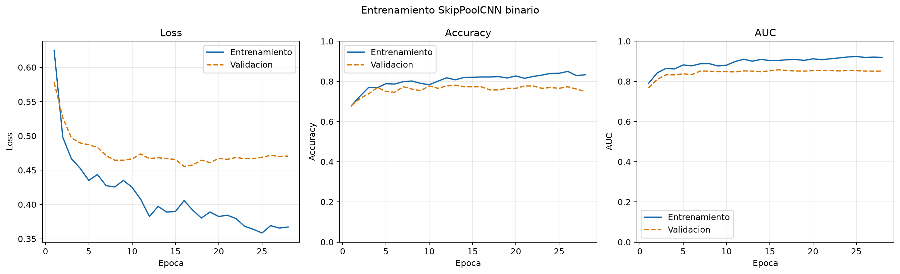
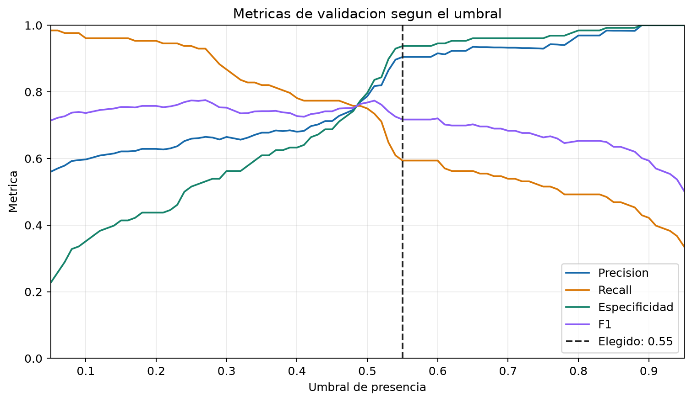
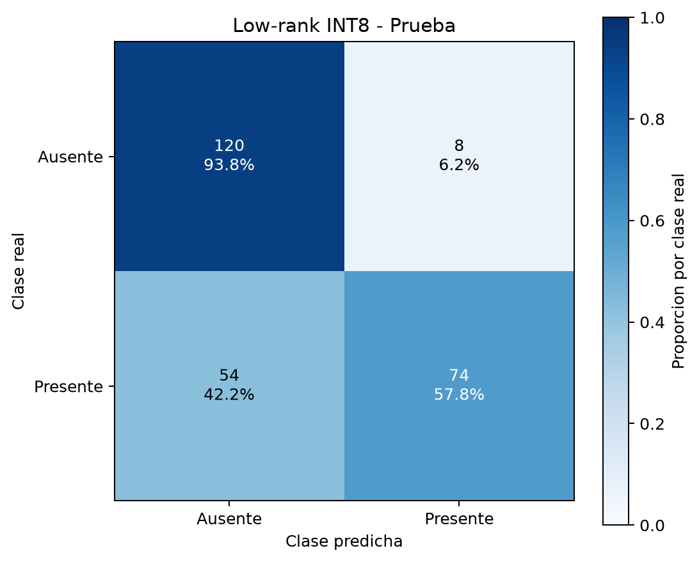

# SkipPoolCNN Low-Rank Factorization Report

Generated: 2026-06-22T19:52:03

## Configuration

- Compression: truncated SVD of the 24-unit `spatial_head` Dense kernel.
- Rank: `8` of maximum `24`.
- Fine-tuning learning rate: `0.0002`.
- Full-rank parameters: `96679`.
- Low-rank parameters: `36967`.
- Parameter reduction: `61.76%`.
- SVD relative reconstruction error: `0.627609`.
- Initial output MAE after factorization: `0.034706`.

The factorization replaces `W` with `A @ B`, where 
`A` has shape `(flattened_features, 8)` and `B` has shape `(8, 24)`.

## Thresholds

- Full rank: `0.5500`.
- Low rank: `0.5500` (fixed).

## Metrics

| model | accuracy | precision | recall | specificity | balanced_accuracy | f1 | f2 | mcc | tn | fp | fn | tp |
| --- | ---: | ---: | ---: | ---: | ---: | ---: | ---: | ---: | ---: | ---: | ---: | ---: |
| full_rank_val | 0.6406 | 0.6429 | 0.6328 | 0.6484 | 0.6406 | 0.6378 | 0.6348 | 0.2813 | 83 | 45 | 47 | 81 |
| full_rank_test | 0.6523 | 0.6757 | 0.5859 | 0.7188 | 0.6523 | 0.6276 | 0.6019 | 0.3074 | 92 | 36 | 53 | 75 |
| low_rank_val | 0.7656 | 0.9048 | 0.5938 | 0.9375 | 0.7656 | 0.7170 | 0.6376 | 0.5657 | 120 | 8 | 52 | 76 |
| low_rank_test | 0.7578 | 0.9024 | 0.5781 | 0.9375 | 0.7578 | 0.7048 | 0.6229 | 0.5525 | 120 | 8 | 54 | 74 |
| low_rank_test_int8 | 0.7578 | 0.9024 | 0.5781 | 0.9375 | 0.7578 | 0.7048 | 0.6229 | 0.5525 | 120 | 8 | 54 | 74 |

## Model Sizes

| artifact | size_mb |
| --- | ---: |
| full_rank_keras | 1.1834 |
| low_rank_keras | 0.5040 |
| low_rank_tflite_float32 | 0.1452 |
| low_rank_tflite_int8 | 0.0425 |

## Artifacts

- full_rank_keras: `outputs\skippool_presence_low_rank_r8\full_rank_skippool.keras`
- low_rank_keras: `outputs\skippool_presence_low_rank_r8\skippool_presence_low_rank_r8.keras`
- low_rank_history: `outputs\skippool_presence_low_rank_r8\low_rank_history.csv`
- dataset_summary: `outputs\skippool_presence_low_rank_r8\dataset_summary.csv`
- tflite_float32: `outputs\skippool_presence_low_rank_r8\skippool_presence_low_rank_r8_float32.tflite`
- tflite_int8: `outputs\skippool_presence_low_rank_r8\skippool_presence_low_rank_r8_int8.tflite`
- tflite_micro_cc: `outputs\skippool_presence_low_rank_r8\skippool_presence_binary_model_data.cc`
- tflite_micro_h: `outputs\skippool_presence_low_rank_r8\skippool_presence_binary_model_data.h`
- plot_training: `outputs\skippool_presence_low_rank_r8\plots\low_rank_training_curves.png`
- plot_threshold: `outputs\skippool_presence_low_rank_r8\plots\threshold_analysis.png`
- plot_confusion: `outputs\skippool_presence_low_rank_r8\plots\confusion_matrix_int8.png`

## Plots







## TFLite

```json
{
  "float32": {
    "input_name": "grayscale_96x96",
    "input_shape": [
      1,
      96,
      96,
      1
    ],
    "input_dtype": "<class 'numpy.float32'>",
    "input_quantization": [
      0.0,
      0.0
    ],
    "output_name": "Identity",
    "output_shape": [
      1,
      1
    ],
    "output_dtype": "<class 'numpy.float32'>",
    "output_quantization": [
      0.0,
      0.0
    ]
  },
  "int8": {
    "input_name": "grayscale_96x96",
    "input_shape": [
      1,
      96,
      96,
      1
    ],
    "input_dtype": "<class 'numpy.int8'>",
    "input_quantization": [
      1.0,
      -128.0
    ],
    "output_name": "Identity",
    "output_shape": [
      1,
      1
    ],
    "output_dtype": "<class 'numpy.int8'>",
    "output_quantization": [
      0.00390625,
      -128.0
    ]
  }
}
```

## Deployment

Only the low-rank INT8 model is needed on the ESP-CAM. SVD and the full-rank model are training-time tools.
