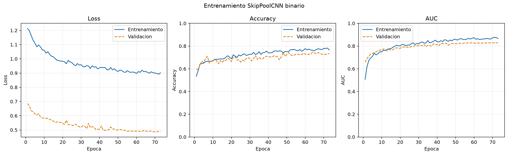
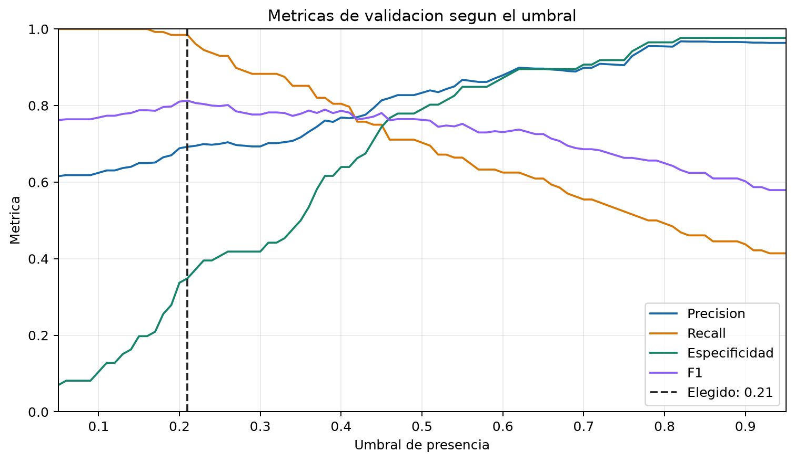
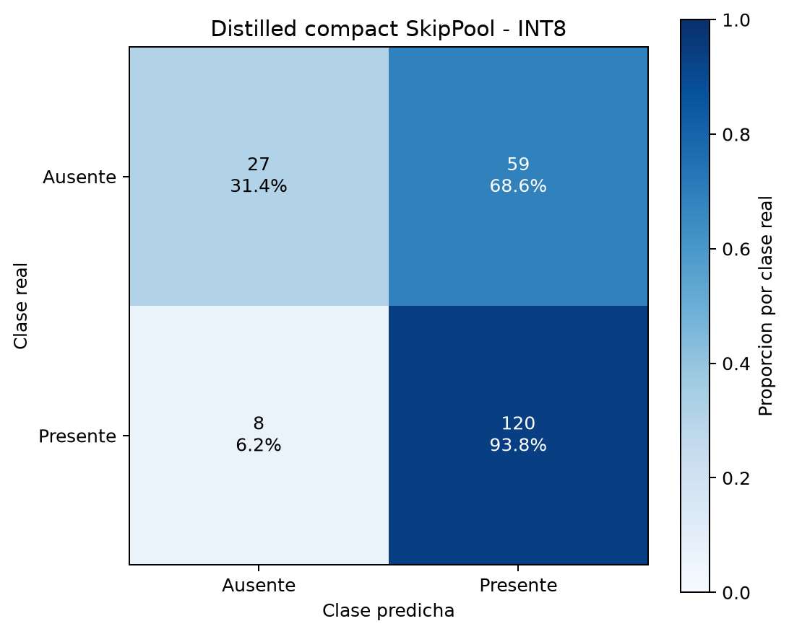

# Compact SkipPool Knowledge Distillation Report

Generated: 2026-06-20T17:23:26

## Distillation

- Student parameters: `6713`
- Alpha (hard-label weight): `0.75`
- Temperature: `2.0`
- Hard-label fine-tuning epochs: `20`
- Fine-tuning learning rate: `0.0001`
- Fine-tuning selected: `False`
- Threshold: `0.2100` (validation f1)
- Teachers:
  - `C:\Users\PC Delf\Desktop\lab2embebidos\outputs\skippool_presence_distilled\fresh_multiscale_teacher.keras`

## Metrics

| model | accuracy | precision | recall | specificity | balanced_accuracy | f1 | f2 | mcc | tn | fp | fn | tp |
| --- | ---: | ---: | ---: | ---: | ---: | ---: | ---: | ---: | ---: | ---: | ---: | ---: |
| teacher_test | 0.7617 | 0.8080 | 0.7891 | 0.7209 | 0.7550 | 0.7984 | 0.7928 | 0.5073 | 62 | 24 | 27 | 101 |
| baseline_test | 0.7056 | 0.6879 | 0.9297 | 0.3721 | 0.6509 | 0.7907 | 0.8686 | 0.3760 | 32 | 54 | 9 | 119 |
| student_val | 0.7290 | 0.6923 | 0.9844 | 0.3488 | 0.6666 | 0.8129 | 0.9078 | 0.4581 | 30 | 56 | 2 | 126 |
| student_test | 0.6916 | 0.6722 | 0.9453 | 0.3140 | 0.6296 | 0.7857 | 0.8743 | 0.3477 | 27 | 59 | 7 | 121 |
| student_test_int8 | 0.6869 | 0.6704 | 0.9375 | 0.3140 | 0.6257 | 0.7818 | 0.8683 | 0.3333 | 27 | 59 | 8 | 120 |

## Artifacts

- teacher_keras: `outputs\skippool_presence_distilled\fresh_multiscale_teacher.keras`
- baseline_keras: `outputs\skippool_presence_distilled_finetuned\compact_baseline.keras`
- student_keras: `outputs\skippool_presence_distilled_finetuned\best_skippool_presence_distilled.keras`
- history: `outputs\skippool_presence_distilled_finetuned\history.csv`
- distillation_history: `outputs\skippool_presence_distilled_finetuned\distillation_history.csv`
- fine_tune_history: `outputs\skippool_presence_distilled_finetuned\fine_tune_history.csv`
- tflite_float32: `outputs\skippool_presence_distilled_finetuned\skippool_presence_distilled_float32.tflite`
- tflite_int8: `outputs\skippool_presence_distilled_finetuned\skippool_presence_distilled_int8.tflite`
- tflite_micro_cc: `outputs\skippool_presence_distilled_finetuned\skippool_presence_distilled_model_data.cc`
- tflite_micro_h: `outputs\skippool_presence_distilled_finetuned\skippool_presence_distilled_model_data.h`

## Plots







## TFLite

```json
{
  "float32": {
    "input_name": "grayscale_96x96",
    "input_shape": [
      1,
      96,
      96,
      1
    ],
    "input_dtype": "<class 'numpy.float32'>",
    "input_quantization": [
      0.0,
      0.0
    ],
    "output_name": "Identity",
    "output_shape": [
      1,
      1
    ],
    "output_dtype": "<class 'numpy.float32'>",
    "output_quantization": [
      0.0,
      0.0
    ]
  },
  "int8": {
    "input_name": "grayscale_96x96",
    "input_shape": [
      1,
      96,
      96,
      1
    ],
    "input_dtype": "<class 'numpy.int8'>",
    "input_quantization": [
      1.0,
      -128.0
    ],
    "output_name": "Identity",
    "output_shape": [
      1,
      1
    ],
    "output_dtype": "<class 'numpy.int8'>",
    "output_quantization": [
      0.00390625,
      -128.0
    ]
  }
}
```
