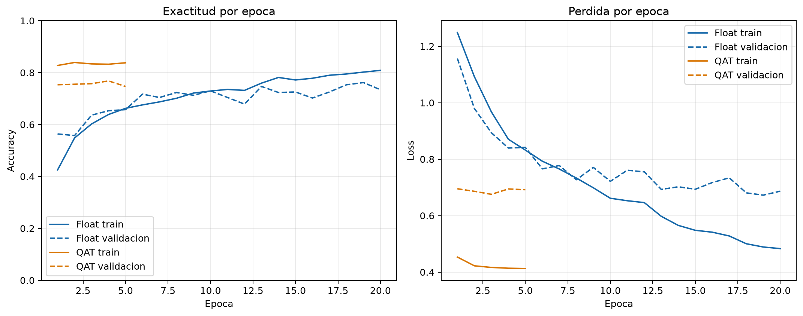
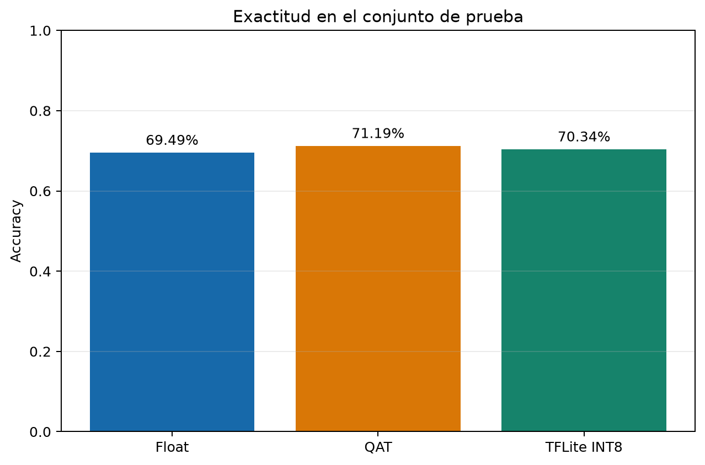
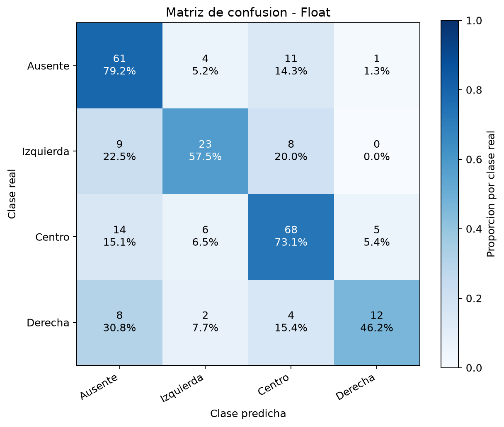
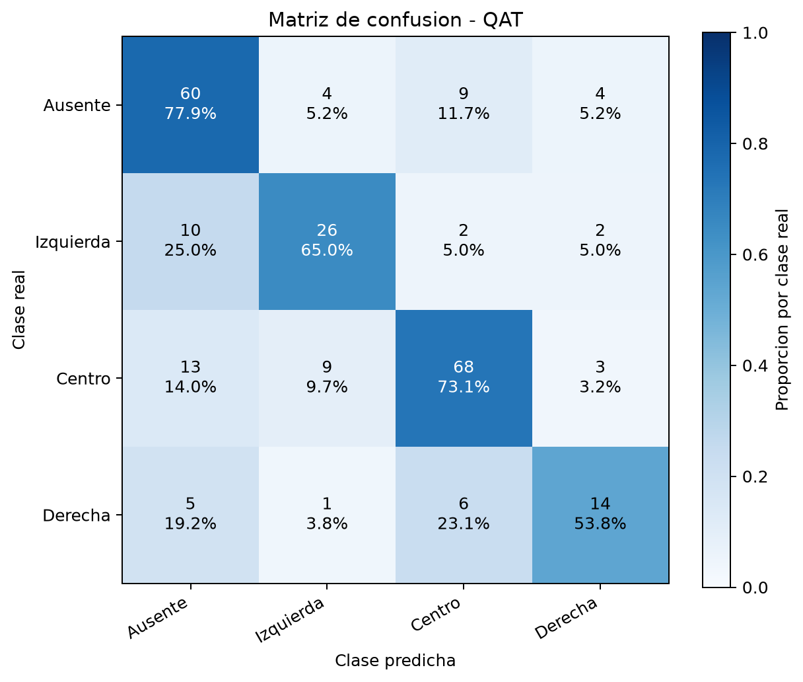
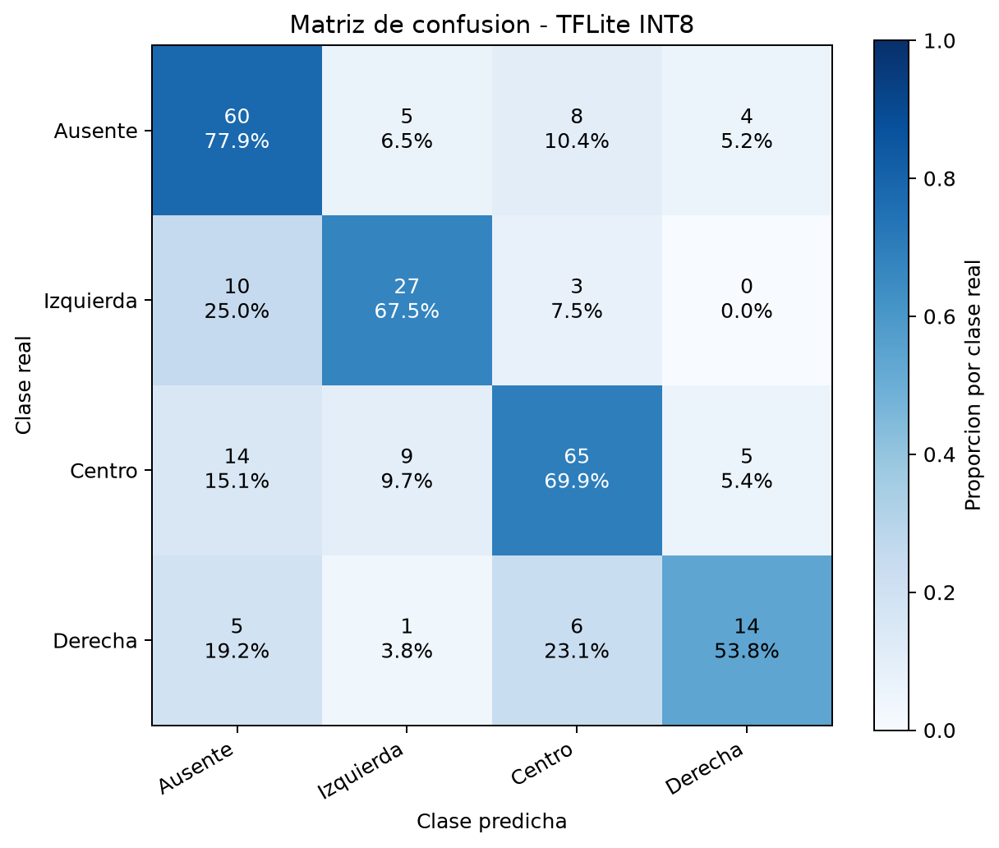

# TensorFlow SkipPoolCNN Report

| model | int8_method | float_test_acc | qat_test_acc | int8_tflite_acc | params |
| --- | --- | ---: | ---: | ---: | ---: |
| cnn_skip_pool_tf | qat_full_int8 | 0.6949 | 0.7119 | 0.7034 | 14060 |

## Model sizes

Sizes use `1 MB = 1024^2 bytes`. The FP32 parameter estimate excludes file metadata.

| artifact | quantization | size_mb |
| --- | --- | ---: |
| Parameters only (estimated) | Float32 | 0.0536 |
| Keras model | Float32, unquantized | 0.2239 |
| TFLite model | Float32, unquantized | 0.0582 |
| TFLite model | Dynamic range | 0.0218 |
| TFLite model | INT8 | 0.0203 |

## Graficos de evaluacion

### Training Curves

### Accuracy Comparison

### Confusion Matrix Float

### Confusion Matrix Qat

### Confusion Matrix Int8

